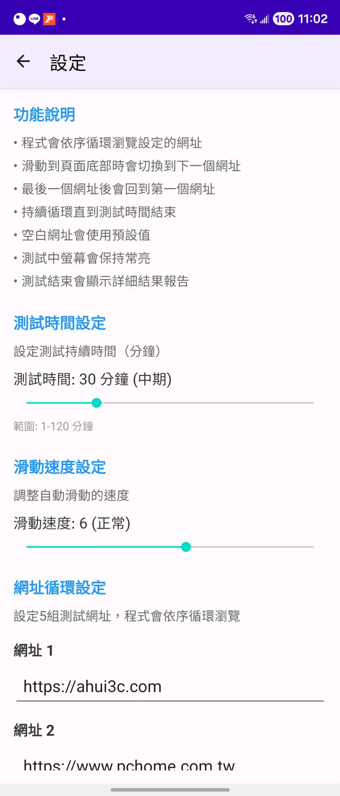
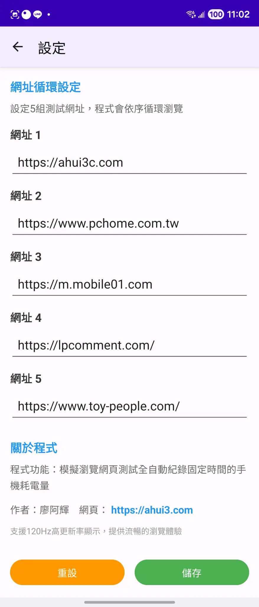
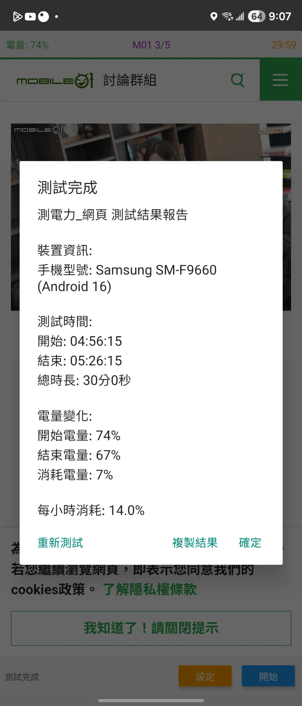

# PowerTesting-Web Android App v0.7

<div align="center">
  
  <br>
  <strong>A comprehensive Android application for battery consumption testing through simulated web browsing behavior</strong>
  <br>
  Automatically simulates human web browsing patterns and accurately records battery consumption
</div>

## 📱 App Screenshots

<div align="center">
  <table>
    <tr>
      <td align="center">
        
        <br>
        <strong>Settings Overview</strong>
      </td>
      <td align="center">
        
        <br>
        <strong>URL Configuration</strong>
      </td>
      <td align="center">
        
        <br>
        <strong>Test Results</strong>
      </td>
    </tr>
  </table>
</div>

## 🎯 Key Features

### 🔋 Battery Testing
- **Countdown Timer**: Displays remaining test time with automatic stop at 00:00
- **Automated Testing**: Fully automated simulation of human web browsing behavior
- **Accurate Recording**: Tracks battery level changes from start to finish
- **Detailed Reports**: Comprehensive test results and battery consumption analysis
- **Adjustable Duration**: Support for 1-120 minute test sessions (default: 60 minutes)

### 🌐 Web Browsing
- **Embedded Browser**: Full WebView experience with JavaScript support
- **5-Website Rotation**: Cycles through 5 configurable test websites
- **Smart Switching**: Automatically switches to next URL when reaching page bottom
- **Default Websites**: Pre-configured with popular Taiwan websites

### ⚡ Scrolling Simulation
- **Natural Scrolling**: Simulates real finger scrolling, not key presses
- **Adjustable Speed**: 10-level scrolling speed configuration
- **Smooth Animation**: Step-by-step smooth scrolling animation
- **Bottom Detection**: Intelligent page bottom detection for URL switching
- **Stay Time Control**: Configurable page dwell time (default: 1.0 second)

### 🔆 Brightness Calibration
- **Dedicated Screen**: Full-screen white background for brightness measurements
- **Maximum Brightness**: Automatically sets screen to highest brightness
- **Clear Instructions**: Top-positioned text with center area for measurements
- **Easy Access**: Available from Settings page with one-tap activation

### 🎨 User Interface
- **Clean Design**: Maximized browser display space with Material Design
- **Real-time Status**: Current battery level, website, and countdown timer
- **Screen Wake Lock**: Keeps screen active during testing
- **120Hz Support**: Optimized for high refresh rate displays
- **Foldable Support**: Samsung Galaxy Z Fold series compatibility

## 📊 Test Results

The application generates detailed test reports including:

```
PowerTesting-Web Test Report

Device Information:
Model: Samsung Galaxy Z Fold5 (Android 14)

Test Duration:
Start: 14:30:15
End: 15:00:28
Total: 30min 13sec

Battery Changes:
Start Level: 85%
End Level: 78%
Consumed: 7%

Hourly Consumption: 13.9%
```

## 🛠️ Technical Specifications

- **Minimum Android**: 7.0 (API 24)
- **Target Android**: 14 (API 34)
- **Programming Language**: Java with Kotlin support
- **UI Framework**: Android Native + Material Design
- **Browser Engine**: WebView with JavaScript support
- **Special Features**: 120Hz high refresh rate support, Foldable device compatibility

## 📥 Download & Installation

### APK Download
- [PowerTesting-Web-v0.7-CountdownTimer-BrightnessCalibration.apk](https://github.com/ahui3c/powertesting-web-Android/releases/latest) - Latest Version

### Installation Steps
1. Download APK file to your Android device
2. Enable "Install from Unknown Sources" in Android settings
3. Tap the APK file to install
4. Grant necessary permissions and start using

## ⚙️ Usage Guide

### Basic Operation
1. **Launch App**: Tap the desktop icon to start
2. **Access Settings**: Tap the "Settings" button in bottom right
3. **Configure Parameters**: Set test duration, scroll speed, and URLs
4. **Start Test**: Return to main page and tap "Start" to begin testing
5. **View Results**: Check detailed report after test completion

### Brightness Calibration
1. **Access Settings**: Go to Settings page
2. **Tap "Brightness Calibration"**: Opens full-screen calibration mode
3. **Measure Brightness**: Use brightness meter on center white area
4. **Exit**: Tap anywhere on screen to return to settings

### Configuration Options
- **Test Duration**: 1-120 minutes adjustable (default: 60 minutes)
- **Scroll Speed**: 10-level speed settings (default: level 6)
- **Stay Time**: 0.5-4.5 seconds page dwell time (default: 1.0 second)
- **URL Configuration**: 5 website rotation setup
- **Default URLs**: 
  - https://ahui3c.com
  - https://www.pchome.com.tw
  - https://m.mobile01.com
  - https://lpcomment.com/
  - https://www.toy-people.com/

## 🔧 Development Environment

### Build Requirements
- Android Studio Arctic Fox or later
- Android SDK 34
- Java 8 or later
- Gradle 8.0

### Project Structure
```
app/
├── src/main/
│   ├── java/com/batterytest/
│   │   ├── MainActivity.java
│   │   ├── SettingsActivity.java
│   │   ├── BrightnessCalibrationActivity.java
│   │   └── TestHistoryActivity.java
│   ├── res/
│   │   ├── layout/
│   │   ├── values/
│   │   └── mipmap-*/
│   └── AndroidManifest.xml
├── build.gradle
└── proguard-rules.pro
```

### Build Commands
```bash
# Debug version
./gradlew assembleDebug

# Release version
./gradlew assembleRelease
```

## 📝 Version History

### v0.7 (2025-09-16) - Latest
- ✅ **Countdown Timer**: Shows remaining test time with auto-stop at 00:00
- ✅ **Brightness Calibration**: Dedicated full-screen white calibration mode
- ✅ **Updated Defaults**: 60-minute test duration, 1-second stay time
- ✅ **Samsung Z Fold Compatibility**: Optimized for foldable devices
- ✅ **Enhanced UI**: Material Design improvements
- ✅ **Settings Integration**: Brightness calibration accessible from settings page

### v0.5 (2025-09-16)
- ✅ Initial brightness calibration implementation
- ✅ Basic countdown timer functionality

### Previous Versions
- v0.4: Multi-website rotation testing
- v0.3: Natural scrolling simulation  
- v0.2: Battery monitoring integration
- v0.1: Basic web browsing test functionality

## 🤝 Contributing

Welcome to submit Issues and Pull Requests to improve this project!

### Submit Issues
- Describe problems or suggestions in detail
- Provide device model and Android version
- For bugs, include reproduction steps

### Submit Pull Requests
- Fork this project
- Create a feature branch
- Commit your changes
- Create a Pull Request

## 📄 License

This project is licensed under the [MIT License](LICENSE).

## 👨‍💻 Author

**ahui3c (廖阿輝)**
- Website: [https://ahui3c.com](https://ahui3c.com)
- Expertise: Android Development, Tech Reviews, Technology Writing

## 🙏 Acknowledgments

Thanks to all testing users for their feedback and suggestions, making this application continuously improved.

## 📞 Support

If you encounter problems during use, please:
1. Check the usage instructions in this README
2. Search existing Issues
3. Submit a new Issue describing the problem
4. Visit the author's website for more information

---

**Note**: This application is for testing and research purposes only. Please use reasonably and pay attention to battery health.

